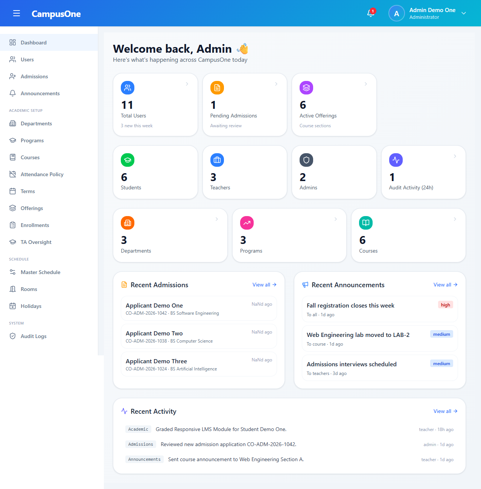
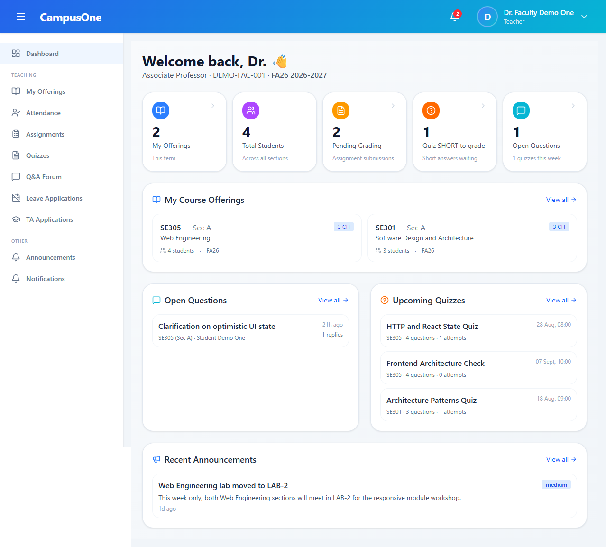
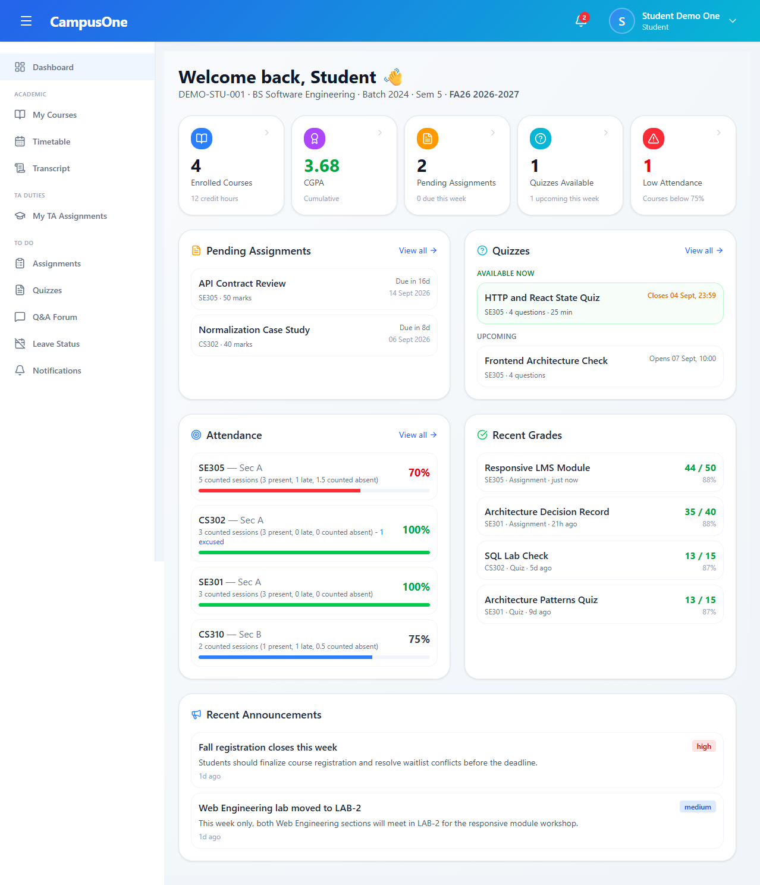
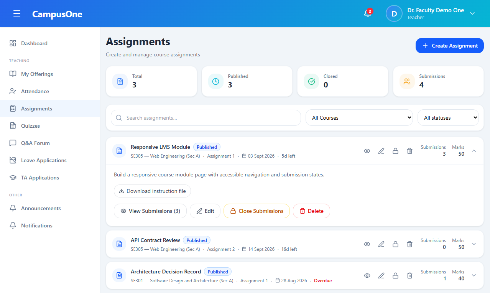
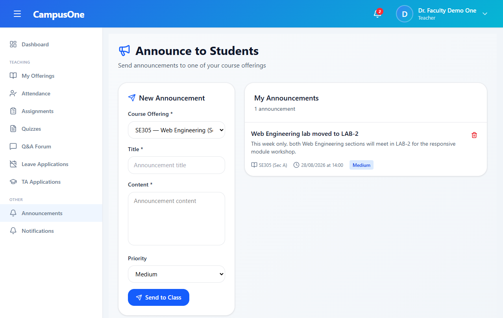
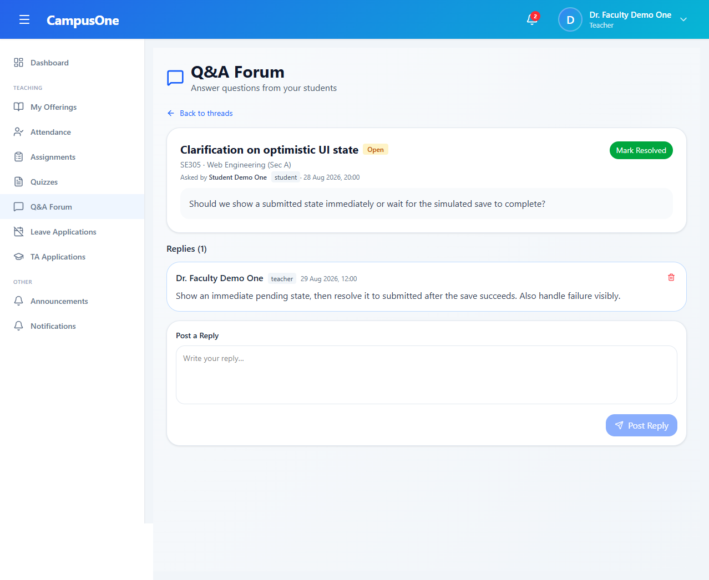
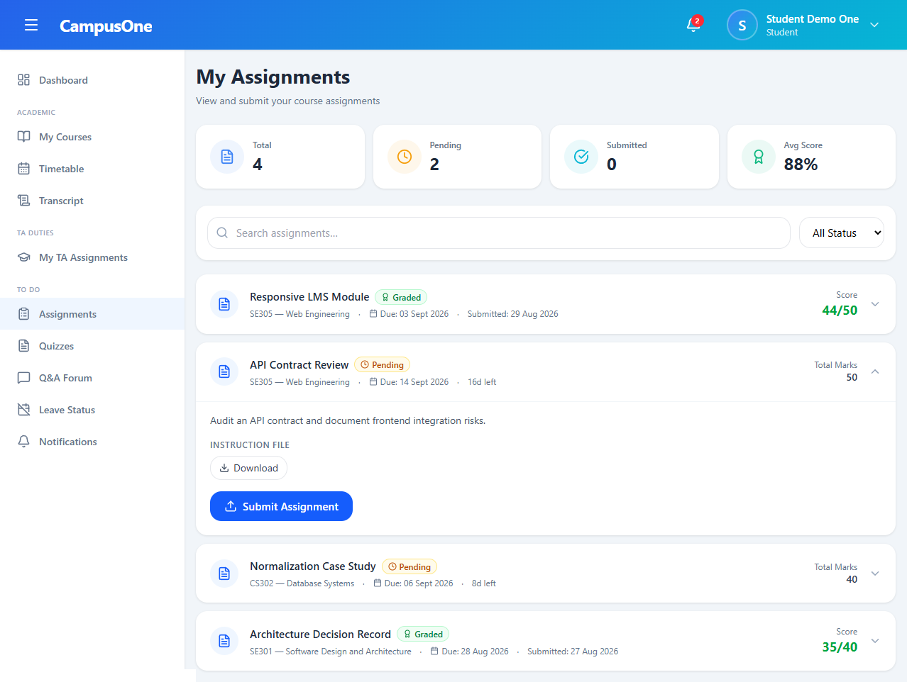
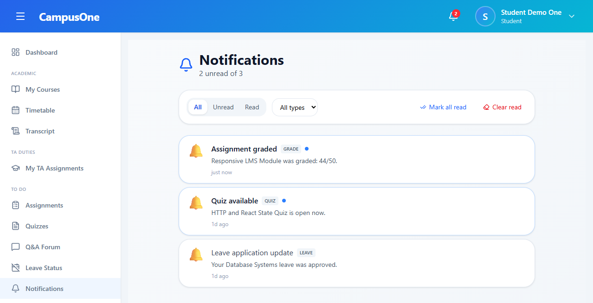

# CampusOne

Full-stack Learning Management System (LMS) and academic management platform built as a Final Year Project.

**Live Demo:** https://campusone.site

CampusOne covers course delivery, assessments, attendance, academic administration, communication, reporting, and Teaching Assistant workflows. The repository contains the original full-stack implementation, while the public demo is a standalone frontend build for recruiter and portfolio review.

## Overview

CampusOne was developed by Muhammad Hamza over approximately 8 months / two semesters as a Final Year Project. It was built end-to-end as a full-stack LMS with role-based academic workflows for admins, teachers, students, and approved Teaching Assistants.

The original source remains in this repository: a React/Vite frontend, an Express/Prisma API, a PostgreSQL/Supabase data layer, authentication, real-time notifications, file storage, email workflows, and OpenAI-powered features. For public viewing, the project also includes a separate frontend-only demo that runs without the original backend or Supabase database.

## Live Demo

**Portfolio demo:** https://campusone.site

The public demo showcases CampusOne's interface and major workflows using local demo data. It runs independently from the original backend and database so recruiters can explore the application without external service dependencies.

Public demo credentials found in `campusone-frontend-demo/src/data/mockData.js`:

| Role | Email | Password |
|---|---|---|
| Admin | `admin@campusone.demo` | `admin123` |
| Teacher | `teacher@campusone.demo` | `teacher123` |
| Student | `student@campusone.demo` | `student123` |

## Key Features

### Academic Management

- Departments, programs, versioned curricula, courses, terms, and prerequisites
- Course offerings, section capacity, enrollments, and section transfer controls
- Semester-incharge workflows
- Scheduling configuration, rooms, class sessions, and holidays
- Student timetable, course registration page, transcript, CGPA, and grade views

### Assessment & Learning

- Assignments with file uploads, submissions, resubmissions, grading, and feedback
- Quiz authoring with draft/published states, online and offline delivery modes, question imports, and printable papers
- MCQ, true/false, and short-answer quiz handling with automatic and manual grading
- Configurable grading components for assignments, quizzes, exams, projects, participation, and lab work
- Attendance marking, attendance summaries, leave-aware attendance calculations, fines, and low-attendance flags
- Lecture management with uploaded course materials

### Communication & Workflow

- Admin and teacher announcements with audience targeting
- In-app notifications with unread state
- Course Q&A threads, replies, status management, and teacher/student views
- Student leave applications and teacher review workflow
- Teaching Assistant applications, approvals, permissions, course tools, pending grade recommendations, and resource uploads

### Reporting & Administration

- Admin reports for overview, enrollment, grades, courses, trends, admissions, and attendance
- User management, Excel student imports, activation/deactivation, unlocking, and deletion workflows
- Admissions settings, public admission application flow, duplicate checks, document uploads, review, and status emails
- Audit log model, admin UI, filters, pagination, and logged review actions

### AI & Automation

- OpenAI-based quiz question generation
- Assignment similarity review using file/text matching, lexical analysis, semantic review, and teacher decisions
- Scheduled notifications for assignment deadlines and quiz openings

## User Roles

| Role | Verified Capabilities |
|---|---|
| Admin | Manage users, admissions, academic setup, offerings, enrollments, scheduling, announcements, reports, audit logs, attendance policy, and TA oversight. |
| Teacher | Manage assigned offerings, lectures, attendance, marks, assignments, quizzes, Q&A, announcements, leave reviews, and TA application reviews. |
| Student | View courses, timetable, grades, transcript, attendance, assignments, quizzes, Q&A, notifications, leave status, and TA application/assignment workflows. |
| Teaching Assistant | A student with an approved `TAAssignment`; permissions can allow roster access, attendance marking, assignment grading recommendations, quiz grading recommendations, Q&A answers, and resource uploads. |

## Tech Stack

| Area | Technology |
|---|---|
| Frontend | React 19, Vite 7, React Router DOM 7 |
| Styling | Tailwind CSS 4, Lucide React, React Hot Toast |
| Backend | Node.js, Express 5 |
| Database | PostgreSQL through Supabase |
| ORM | Prisma 7 with `@prisma/adapter-pg` |
| Authentication | JWT, bcrypt, TOTP, email OTP, trusted devices |
| Authorization | Role-Based Access Control and admin permissions |
| Real-Time | Socket.IO |
| AI | OpenAI API |
| Email | Resend |
| Storage | Supabase Storage |
| Deployment | Vercel for the portfolio demo; original backend designed as a separate Node service |

## Architecture

Original full-stack implementation:

```text
React/Vite client
  -> Express REST API
  -> Prisma ORM
  -> PostgreSQL / Supabase

Additional services:
  Socket.IO notifications
  OpenAI quiz and similarity workflows
  Resend email workflows
  Supabase Storage uploads
```

Recruiter-facing demo:

```text
React/Vite demo
  -> Mock API layer
  -> browser localStorage
```

## Repository Structure

```text
CampusOne/
|-- campusone-backend/        Original Express, Prisma, PostgreSQL API
|-- campusone-frontend/       Original React/Vite frontend connected to the backend
|-- campusone-frontend-demo/  Standalone frontend demo using mock/localStorage data
|-- supabase/                 Supabase configuration and database/storage setup
|-- docs/                     Public technical documentation
`-- README.md                 Project overview and setup guide
```

Generated folders and build artifacts are intentionally omitted from this map.

## Documentation

- [Architecture](./docs/ARCHITECTURE.md) - system design, backend/frontend structure, data model, and integrations
- [Features](./docs/FEATURES.md) - detailed feature inventory
- [Security](./docs/SECURITY.md) - implemented authentication, authorization, and security controls
- [Setup](./docs/SETUP.md) - full-stack local development setup
- [Demo](./docs/DEMO.md) - public frontend demo behavior and credentials

## Screenshots

| Admin Dashboard | Teacher Dashboard |
|---|---|
|  |  |

| Student Dashboard |
|---|
|  |

| Teacher Assignments | Teacher Announcements |
|---|---|
|  |  |

| Teacher Q&A |
|---|
|  |

| Student Assignments | Student Notifications |
|---|---|
|  |  |

## Security

Security-related functionality implemented in the original full-stack system includes:

- JWT-based authentication and protected API routes
- Password hashing with bcrypt
- MFA with authenticator TOTP and email OTP
- Trusted-device management
- Failed-login tracking and account lockout
- First-login setup and password reset workflows
- Super-admin recovery workflow
- Role checks, admin permission checks, and offering-scoped TA permission checks
- Audit logging for administrative and review actions

## AI & Real-Time Features

- Quiz generation uses the OpenAI API to produce structured question drafts with validation and rate-limit handling.
- Assignment similarity functionality supports exact file hash checks, normalized text checks, lexical overlap, semantic review support, persistent reports, stale-snapshot detection, and teacher review decisions.
- Real-time notifications use Socket.IO, with persisted notification records and client-side unread state.

## Running the Full-Stack Project Locally

Prerequisites:

- Node.js and npm
- A PostgreSQL/Supabase database connection
- Backend environment variables based on `campusone-backend/.env.example`
- Frontend environment variables based on `campusone-frontend/.env.example`

Backend:

```bash
cd campusone-backend
npm install
npx prisma generate
npm run db:push
npm run storage:buckets
npm run db:seed
npm run dev
```

Useful backend scripts:

| Command | Purpose |
|---|---|
| `npm run start` | Run `server.js` with Node |
| `npm run dev` | Run the API with Nodemon |
| `npm run db:push` | Push Prisma schema changes |
| `npm run db:seed` | Seed demo/development data |
| `npm run db:superadmin` | Create a super admin account |
| `npm run db:studio` | Open Prisma Studio |
| `npm run storage:buckets` | Ensure required Supabase Storage buckets exist |

Frontend:

```bash
cd campusone-frontend
npm install
npm run dev
```

Useful frontend scripts:

| Command | Purpose |
|---|---|
| `npm run dev` | Start the Vite development server |
| `npm run build` | Build the frontend |
| `npm run lint` | Run ESLint |
| `npm run preview` | Preview the production build locally |

The repository root also includes `npm run dev`, which starts the backend and original frontend together with `concurrently`.

## Running the Demo Locally

The standalone demo runs without the original backend, database, Supabase Storage, Socket.IO server, Resend, or OpenAI credentials.

```bash
cd campusone-frontend-demo
npm install
npm run dev
```

Useful demo scripts:

| Command | Purpose |
|---|---|
| `npm run dev` | Start the demo Vite development server |
| `npm run build` | Build the demo frontend |
| `npm run lint` | Run ESLint |
| `npm run preview` | Preview the demo production build locally |

## Deployment

| Target | Current Status |
|---|---|
| Portfolio demo | Frontend-only demo deployed on Vercel at https://campusone.site |
| Original frontend | React/Vite app includes Vercel SPA rewrite configuration |
| Original backend | Express API remains in the repository as the full-stack implementation and runs as a separate Node service |
| Data and files | Original architecture uses PostgreSQL/Supabase and Supabase Storage |

The public demo should not be read as a live deployment of the original full-stack backend. It is a recruiter-friendly version of the interface and workflows using demo data.

## Project Scope

- Final Year Project
- Developed over approximately 8 months / two semesters
- Tested with approximately 50 students and 5 teachers
- Built as an academic project rather than an official university-wide production deployment

## Author

**Muhammad Hamza**

Full-Stack Developer

- GitHub: https://github.com/Hamza-Zartaj
- LinkedIn: https://www.linkedin.com/in/Hamzazartaj
- Email: hamza.zartaj.work@gmail.com
